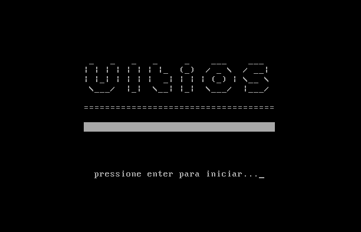
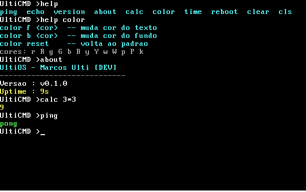

<div align="center">



# UltiOS


A simple operating system built from scratch using Assembly and C.

[English](#english) • [Português](#português)

</div>

---

## English

### About

UltiOS is an experimental operating system built entirely from scratch, without any base OS or framework. The goal is to understand how a computer works at the lowest level — from the first instruction executed at boot to a functional terminal shell.

This is a learning/portfolio project, not a production OS.

### Features

- Custom bootloader written in x86 Assembly (NASM)
- ASCII art logo and animated loading bar at boot
- "Press Enter to start" screen before booting
- 32-bit protected mode kernel written in C
- Direct VGA memory writing (0xB8000)
- Real hardware timer via PIT + IDT (Interrupt Descriptor Table)
- Terminal scroll when screen fills up
- UltiCMD shell with:
  - Keyboard input with uppercase support (Shift)
  - Backspace and Enter
  - Command history (arrow keys ↑↓)
  - Foreground and background color support

### Screenshots

| Boot | Shell |
|------|-------|
|  |  |

### UltiCMD Commands

| Command | Description |
|---------|-------------|
| `help` | Lists all available commands |
| `help <cmd>` | Shows detailed usage for a command |
| `ping` | Replies with `pong` |
| `echo <text>` | Prints text to the screen |
| `version` | Shows OS version |
| `about` | Shows OS info (version, dev, uptime) |
| `time` | Shows system uptime |
| `calc <expr>` | Calculator — ex: `calc 2 + 2` |
| `color f <c>` | Changes text color |
| `color b <c>` | Changes background color |
| `color reset` | Resets colors to default |
| `clear` / `cls` | Clears the screen |
| `reboot` | Reboots the system |

**Available colors:** `r` `R` `g` `G` `b` `B` `y` `Y` `w` `W` `p` `P` `k`
(lowercase = dark, uppercase = bright, `k` = black)

### Architecture

```
BIOS
 └── Bootloader (Assembly - 512 bytes)
      └── Logo + Loading bar + Press Enter
          └── Kernel (C - 32-bit protected mode)
               ├── IDT (Interrupt Descriptor Table)
               ├── PIT (Programmable Interval Timer)
               └── UltiCMD Shell
```

### Requirements

- NASM
- GCC (with m32 support)
- QEMU
- GNU Binutils
- SeaBIOS

On Ubuntu/WSL2:
```bash
sudo apt install nasm gcc binutils qemu-system-x86 seabios make
```

### Building and Running

```bash
git clone https://github.com/UltiCorp/UltiOS.git
cd UltiOS
make
```

### Project Structure

```
UltiOS/
├── boot.asm          # Bootloader (x86 Assembly)
├── link.ld           # Linker script
├── Makefile          # Build automation
├── kernel/
│   ├── entry.asm     # Kernel entry point (Assembly)
│   ├── idt.asm       # IDT/timer interrupt handler (Assembly)
│   └── kernel.c      # Kernel + UltiCMD shell (C)
├── iso/
│   └── boot/
│       └── grub/
│           └── grub.cfg
└── assets/
    ├── boot.PNG
    └── os.png
```

### How it works

**Bootloader** — The BIOS loads the first 512 bytes of the disk into memory at address `0x7C00` and jumps to it. The bootloader displays the UltiOS logo, an animated loading bar, and waits for Enter before handing control to the kernel.

**Kernel** — Runs in 32-bit protected mode. Instead of using BIOS calls (unavailable in protected mode), it writes characters directly to VGA memory at `0xB8000`. Each character takes 2 bytes: one for the ASCII code and one for the color.

**IDT + PIT** — The Interrupt Descriptor Table routes hardware interrupts to the correct handlers. The Programmable Interval Timer fires at ~100Hz and increments a tick counter, enabling accurate uptime tracking.

**UltiCMD** — Reads keyboard scancodes directly from I/O port `0x60`, converts them to ASCII, and renders them on screen. Supports typing, uppercase (Shift), backspace, Enter, command history, colors, and terminal scroll.

---

## Português

### Sobre

UltiOS é um sistema operacional experimental construído do zero, sem nenhum OS base ou framework. O objetivo é entender como um computador funciona no nível mais baixo — desde a primeira instrução executada no boot até um terminal shell funcional.

Este é um projeto de aprendizado e portfólio, não um OS de produção.

### Funcionalidades

- Bootloader customizado em Assembly x86 (NASM)
- Logo em ASCII art e barra de loading animada no boot
- Tela "Pressione Enter para iniciar" antes do boot
- Kernel em modo protegido 32-bit escrito em C
- Escrita direta na memória VGA (0xB8000)
- Timer real via PIT + IDT (Interrupt Descriptor Table)
- Scroll do terminal ao encher a tela
- Shell UltiCMD com:
  - Input de teclado com suporte a maiúsculas (Shift)
  - Backspace e Enter
  - Histórico de comandos (setas ↑↓)
  - Suporte a cores de texto e fundo

### Comandos do UltiCMD

| Comando | Descrição |
|---------|-----------|
| `help` | Lista todos os comandos disponíveis |
| `help <cmd>` | Mostra uso detalhado de um comando |
| `ping` | Responde com `pong` |
| `echo <texto>` | Imprime texto na tela |
| `version` | Mostra a versão do OS |
| `about` | Mostra info do OS (versão, dev, uptime) |
| `time` | Mostra o uptime do sistema |
| `calc <expr>` | Calculadora — ex: `calc 2 + 2` |
| `color f <c>` | Muda a cor do texto |
| `color b <c>` | Muda a cor do fundo |
| `color reset` | Volta às cores padrão |
| `clear` / `cls` | Limpa a tela |
| `reboot` | Reinicia o sistema |

**Cores disponíveis:** `r` `R` `g` `G` `b` `B` `y` `Y` `w` `W` `p` `P` `k`
(minúscula = escuro, maiúscula = brilhante, `k` = preto)

### Arquitetura

```
BIOS
 └── Bootloader (Assembly - 512 bytes)
      └── Logo + Barra de loading + Pressione Enter
          └── Kernel (C - modo protegido 32-bit)
               ├── IDT (Interrupt Descriptor Table)
               ├── PIT (Programmable Interval Timer)
               └── Shell UltiCMD
```

### Requisitos

- NASM
- GCC (com suporte a m32)
- QEMU
- GNU Binutils
- SeaBIOS

No Ubuntu/WSL2:
```bash
sudo apt install nasm gcc binutils qemu-system-x86 seabios make
```

### Como rodar

```bash
git clone https://github.com/UltiCorp/UltiOS.git
cd UltiOS
make
```

### Como funciona

**Bootloader** — A BIOS carrega os primeiros 512 bytes do disco na memória no endereço `0x7C00` e pula pra ele. O bootloader exibe a logo do UltiOS, uma barra de loading animada e aguarda o Enter antes de passar o controle pro kernel.

**Kernel** — Roda em modo protegido 32-bit. Em vez de usar chamadas da BIOS (indisponíveis no modo protegido), escreve caracteres diretamente na memória VGA no endereço `0xB8000`. Cada caractere ocupa 2 bytes: um pro código ASCII e um pra cor.

**IDT + PIT** — A Interrupt Descriptor Table roteia interrupções de hardware para os handlers corretos. O Programmable Interval Timer dispara a ~100Hz e incrementa um contador de ticks, permitindo medir o uptime com precisão.

**UltiCMD** — Lê scancodes do teclado diretamente da porta I/O `0x60`, converte pra ASCII e renderiza na tela. Suporta digitação, maiúsculas (Shift), backspace, Enter, histórico de comandos, cores e scroll do terminal.

---

<div align="center">
Made by <a href="https://github.com/UltiCorp">UltiCorp.</a>

<a href="https://github.com/UltimateStrength">Marcos Ulti</a> [DEV]
</div>
